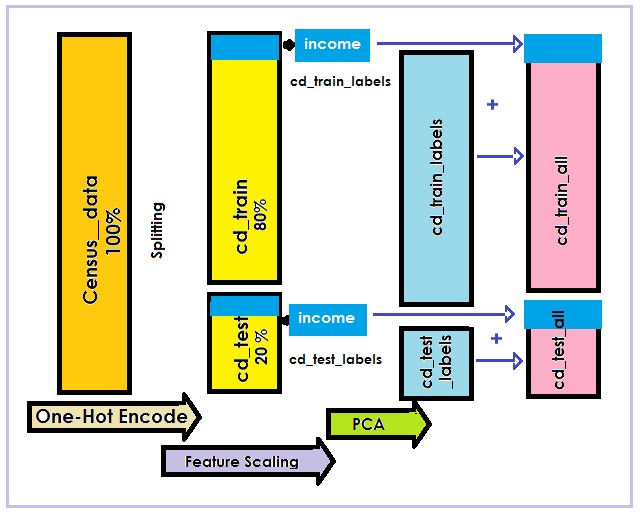

```{r setup, include=FALSE}
    library(knitr)
    knitr::opts_chunk$set(echo = TRUE, warning = FALSE, message = FALSE, 
                          cache.lazy = FALSE, fig.align='center', fig.width=6, fig.height=4.5)
```

\pagebreak

# 1. Introduction

### 1.1 Overview

This report is prepared to fulfill the completion requirement of the **HavardX PH125.9x Data Science Capstone** course. In this project, an income classifier prediction system is created using the US Census 1994 dataset. A classification system is a subclass of an information filtering system that seeks to classify people using demographics to predict whether a person will earn an annual income over 50K dollars or not.


### 1.2 Project Goal

The goal of this project is to train machine learning algorithms (beyond standard linear regression) that predict whether income exceeds $50K per annum based on census data with an accuracy more than 80% and then compares their performance with other prediction models.


### 1.3 Key steps performed

Following are the key steps performed in this project:

 * Importing the dataset and setup
 * Data wrangling
 * Exploratory data analysis and visualization 
 * Spliting the curated dataset and processing
 * Creating and tuning predective models
 * Reporting results 

\pagebreak

# 2. Data and setup

The first step in the whole process is to import and setup data, before performing any data wrangling.

### 2.1 Adult Census Income DataSet

Let's start with the dataset, as per course instruction, Machine Learning analyses friendly **Adult Census Income** dataset, provided by UCI is used. The data was extracted from the 1994 Census bureau database by Ronny Kohavi and Barry Becker (Data Mining and Visualization, Silicon Graphics). The dataset is then cleaned considering the following criteria: 

 - age > 16
 - adjusted gross income > $100
 - final weighting > 1
 - working hours per week > 0

This dataset can be found and downloaded here:

* Adult Census Income dataset:           http://archive.ics.uci.edu/ml/machine-learning-databases/adult/adult.data


### 2.2 Data Import and Initial Setup

To assist with our data import and initial setup, several packages from *CRAN* is utilized and loaded. These will be automatically downloaded and installed during code execution. 


```{r data import and initial setup}
    ####################################################
    # to import and setup data
    ####################################################

    # Install requested packages if not found
    if (!require(tidyverse))
      install.packages("tidyverse", repos = "http://cran.us.r-project.org")
    if (!require(caret))
      install.packages("caret", repos = "http://cran.us.r-project.org")
    if (!require(data.table))
      install.packages("data.table", repos = "http://cran.us.r-project.org")
    if (!require(e1071))
      install.packages("e1071", dependencies=TRUE, 
                       repos = "http://cran.us.r-project.org")
    if (!require(rpart))
      install.packages("rpart", repos = "http://cran.us.r-project.org")
    if (!require(ranger))
      install.packages("ranger", dependencies=TRUE, 
                       repos = "http://cran.us.r-project.org")
    if (!require(gbm))
      install.packages("gbm",repos = "http://cran.us.r-project.org")
    if (!require(dummies))
      install.packages("dummies", repos = "http://cran.us.r-project.org")
    if (!require(dplyr))
      install.packages("dplyr")
    if (!require(tidyr))
      install.packages("tidyr")    
    
    # Load libraries
    library(tidyverse) # to untidy data
    library(caret) # Classification And Regression
    library(e1071) # SVM 
    library(ggplot2) # for plotting graphs
    library(dummies) # dummy variables (one hot encoder)
    library(ranger) # fast Random Forest
    library(rpart) # Decision Tree
    library(class) # KNN
    library(hexbin) # plotting
    library(lubridate) # date
    library(knitr) # LaTeX pdf
    library(kableExtra) # LaTeX pdf

    # Adult Census Income dataset
    # http://archive.ics.uci.edu/ml/machine-learning-databases/adult

    # to store objects from memory to the filesystem
    datafile <- "Income.RData"
    
    # to check if datafile is already downloaded
    if (!file.exists("Income.RData"))
    {
      fileURL <-
        "http://archive.ics.uci.edu/ml/machine-learning-databases/adult/adult.data"
      
      destfile_adult <- "./dataset/adult.data"
      
      # Download only if destination data file - adult.data
      # is not found on the dataset directory folder
      if (!file.exists(destfile_adult))
      {
        # Create dataset folder file if it doesn't exists
        if (!dir.exists("./dataset"))
        {
          dir.create("./dataset")
        }
        
        # Download file from url to temp file
        download.file(fileURL, destfile_adult,  quiet = TRUE)
        
        print("Downloading file to the dataset directory")
        
      }
      # to name dataset columns
      c_names <-
        c("age", "workclass", "fnlwgt", "education", "education-num", 
          "marital-status", "occupation", "relationship", "race", "sex", 
          "capital-gain", "capital-loss", "hours-per-week", "native-country", "income")
      
      
      # to read the data from the file and store in the census_data object
      census_data <-
        read.csv(file = "./dataset/adult.data", header = FALSE, 
                 col.names = c_names, stringsAsFactors = T, strip.white = TRUE)
      
      # replace . in the columns names
      colnames(census_data) <- str_replace_all(colnames(census_data), "\\.", "_")
      
      # to Save census_data object to datafile
      save(census_data, file = datafile)
      
      # Remove unused objects from the memory
      rm(c_names, fileURL, datafile, destfile_adult)
      
    } else {
      # lo Load the datafile if it already exists
      load(datafile)
    }
```

<br/>

\pagebreak

# 3. Data Wrangling

The next step is to understand the data through a brief data review and then do data wrangling as per the necessity.

### 3.1 Initial exploration

Before proceeding further with analysis, examining the data is important. The first step in it, is to understand the format and the contents by looking at the few rows.

```{r Inital analysis-head}
    # Display first few rows to understand the data structure
    glimpse(census_data)
```

The dataset has 32,561 records and 15 attributes.


#### Dataset Summary 
Summry of the dataset can be seen by the following snippet:

```{r summary, include=TRUE}
    # Summary of the dataset
    summary(census_data)
```


#### Column types and class

Let's check column types and their class.

```{r Columns}
    # To display dataset column types and summary
    col_type <- as.data.frame(lapply(census_data, class)) %>%
      .[1, ] %>%
      gather(variable, R_class , 1:ncol(.)) %>%
      mutate(data_type = ifelse(
        R_class == "factor",
        "categorical",
        ifelse(variable == "education_num", "categorical", "continuous")
      )) 
    col_type %>%
      # to format table with theme
      kable() %>%
      kable_styling(latex_options = c("striped", "hover", "condensed")) 
```


### 3.2 Tidying data

Based on the initial understanding further data analysis is required to identify data cleaning necessities. Following are the steps to tidy the data:


#### Duplicate Records

Let's first check for any duplicate record. The following table shows there are 24 duplicate rows.

```{r duplicates}
    # to check for duplicate records
    census_data %>%
      summarize(record_count = n(),
                distinct_records = n_distinct(.)) %>%
      mutate(duplicate_records = record_count - distinct_records) %>%
      mutate(duplicate_percent = 
               paste0(round(duplicate_records / record_count * 100, 1), " %")) %>%
      # to format table with theme
      kable() %>%
      kable_styling(latex_options = c("striped", "hover", "condensed")) %>%
      row_spec(0, bold = T)

```


<br/>

#### Missing Data

By closely looking at the data, it can be observed that there are columns with value "?". This is also supported by the dataset details available on UCI website that **unknown** values are labeled as **?**. 

As it can be seen from the below table, there are 2,399 incomplete records. Precisely, there are missing values in `workclass`, `occupation`, and `native_country` columns. The table below displays the missing columns and record statistics.

```{r missing data}
    #to check if any explicit missing value marked with NA
      anyNA(census_data)

    # to check missing values labeled as "?"

    # first check for the records with any missing value (?)
    missing_count_tbl <-
      map_df(census_data, ~ str_detect(., pattern = "\\?")) %>%
      rowSums() %>%
      tbl_df() %>%
      filter(value > 0) %>%
      summarize(missing_count = n()) %>%
      # to create a table to display the missing count and percent
      mutate(missing_percent =
               paste0(round(missing_count / nrow(census_data) * 100, 1), "%"),
             Column = "Record with any missing columns") %>% 

      select(Column, missing_count, missing_percent)
    
      # now check for individual columns with missing values
      # and bind it with the existing table
    
      map_df(census_data, ~ sum(str_detect(., pattern = "\\?"))) %>%

      gather(Column, missing_count, 1:15) %>%
      mutate(missing_percent = 
               paste0(round(missing_count / nrow(census_data) * 100, 1), "%")) %>%
      bind_rows(missing_count_tbl) %>%
      # filter-out columns with no missing value
      filter(missing_count > 1) %>%
      # arrange rows by missing count
      arrange(desc(missing_count)) %>%
      # to format table with theme
      kable() %>%
      kable_styling(latex_options = c("striped", "hover", "condensed")) %>%
      row_spec(0, bold = T) 
```


#### Impute missing values

To prepare the dataset for analysis, getting rid if missing values in an important step. The easiest method is to replace the missing values with the mean for numerical variables; however, it makes more sense to remove records with missing values for categorical attribtes using the following code:

```{r impute_missing}
    # first to convert missing values ? to NA
    # for workclass, occupation, and native_country
    census_data$workclass<-ifelse(census_data$workclass=='?',
                                  NA, as.character(census_data$workclass))
    census_data$occupation<-ifelse(census_data$occupation=='?',
                                   NA, as.character(census_data$occupation))
    census_data$native_country<-ifelse(census_data$native_country=='?',
                                       NA, as.character(census_data$native_country))

    # next remove rows with missing values
    census_data <- na.omit(census_data)
    
```

<br/>

#### Combine Marital Status column catagories

Next, collalte `marital_status` column values into 3 categories - *Married, Not-married, Never-married* using the following code:


```{r marital_status}
    # to combine the column values catagories 
    census_data$marital_status <- as.character(census_data$marital_status)
    
    # to create two new categories, Never-married is already present
    Married <- c("Married-AF-spouse", "Married-civ-spouse", "Married-spouse-absent")
    Notmarried <- c("Divorced","Separated", "Widowed")

    # to update the marital_status column with the new catagories    
    census_data$marital_status[census_data$marital_status %in% Married] <-
      "Married"
    census_data$marital_status[census_data$marital_status %in% Notmarried] <-
      "Not-married"
    
    # to display the table
    table(census_data$marital_status) %>%
      kable() %>%
      kable_styling(latex_options = c("striped", "hover", "condensed"))
```


#### Remove Education_Num column

`education` and `education_num` variables represent the same data with `education_num` as ordinal representation. We can get rid of `education_num` to clean the data using the following code:
 

```{r education_num}
    # to remove education_num column
    census_data <- census_data %>%
      select(-education_num)
```


<br/>

#### Combine Capital Gain and Capital Loss columns

Next, the `capital_gain` and  `capital_loss` columns can be combined into a single column `capital`. Further, `capital_gain` and  `capital_loss` columns can be removed to aid the analysis, using the following code:


```{r capital}
    # to combine capital gain and capital loss columns
    # into a single column Capital,
    # a positive value represents gain and negative represents loss
    census_data <- census_data %>%
      mutate(capital = capital_gain - capital_loss) %>%
      # then remove capital_gain and capital_loss
      select(-capital_gain, -capital_loss)
```

\pagebreak

#### Remove Final Weight column

The final weight is represented by `fnlwgt` column, adjusts the weight as per population size of the number of people in the census data. For example, a record gets a high weight if the proportion of such samples is comparatively small in the overall population and vice-versa. This is not useful in the analysis, hence, can be removed.


```{r fnlwgt}
    # to remove fnlwgt column
    census_data <- census_data %>%
      select(-fnlwgt)
```


#### Combine Native Country column catagories

There are too many categories in `native_country` column, it can be reduced to their respective regions and key countries can be kept. The countries are categorized among their respective regions and leaving key countries such as the *US* to see if native to the countries make any difference to the income prediction.

```{r native_country}
    # to combine the column values catagories 

    # following are the new catogories
    LatinAmerica <- c("Dominican-Republic","Guatemala","Haiti","Honduras",
                      "Jamaica","Mexico","Nicaragua", "Outlying-US(Guam-USVI-etc)", 
                      "Puerto-Rico","Trinadad&Tobago","Cuba")

    SouthAmerica <- c("Peru","Ecuador","El-Salvador","Columbia")
    
    Europe <- c("France","Germany","Greece","Holand-Netherlands",
                "Hungary","Italy","Poland", "Portugal","Puerto-Rico",
                "South","Ireland","Yugoslavia")
    
    Asia <- c("China","Hong","India","Japan","Iran")
    
    SE_Aisa <- c("Vietnam","Cambodia","Thailand","Laos","Philippines","Taiwan")
    
    US <- c("United-States")
    UK <- c("England","Scotland")
    Canada <- c("Canada")

    # to update the native_country column with the new catagories    
    census_data$native_country[census_data$native_country %in% LatinAmerica] <-
      "Latin America"
    census_data$native_country[census_data$native_country %in% Asia] <-
      "Asia"
    census_data$native_country[census_data$native_country %in% SE_Aisa] <-
      "South East Aisa"
    census_data$native_country[census_data$native_country %in% SouthAmerica] <-
      "South America"
    census_data$native_country[census_data$native_country %in% Europe] <-
      "Europe"
    census_data$native_country[census_data$native_country %in% US] <-
      "US"
    census_data$native_country[census_data$native_country %in% UK] <-
      "UK"
    census_data$native_country[census_data$native_country %in% Canada] <-
      "Canada"

    # to display the data in a tabular form
    table(census_data$native_country) %>%
          kable() %>%
          kable_styling(latex_options = c("striped", "hover", "condensed"))
```

<br/>

#### Combine Education column catagories

Similarly, categories in `education` column can be combined into a fewer columns to make the modeling more efficient.


```{r education}
    # to combine the column values catagories 

    # No-college and Associates are the new additonal categories
    census_data$education = gsub("^10th", "No-college", census_data$education)
    census_data$education = gsub("^11th", "No-college", census_data$education)
    census_data$education = gsub("^12th", "No-college", census_data$education)
    census_data$education = gsub("^1st-4th", "No-college", census_data$education)
    census_data$education = gsub("^5th-6th", "No-college", census_data$education)
    census_data$education = gsub("^7th-8th", "No-college", census_data$education)
    census_data$education = gsub("^9th", "No-college", census_data$education)
    census_data$education = gsub("^Assoc-acdm", "Associates", census_data$education)
    census_data$education = gsub("^Assoc-voc", "Associates", census_data$education)

    census_data$education = gsub("^Bachelors", "Bachelors", census_data$education)
    census_data$education = gsub("^Doctorate", "Doctorate", census_data$education)
    census_data$education = gsub("^HS-Grad", "HS-Graduate", census_data$education)
    census_data$education = gsub("^Masters", "Masters", census_data$education)
    census_data$education = gsub("^Preschool", "No-college", census_data$education)
    census_data$education = gsub("^Prof-school", "Prof-School", census_data$education)
    census_data$education = gsub("^Some-college", "Some-college", census_data$education)
    
    # to display the data in a tabular form
    table(census_data$education) %>%
          kable() %>%
          kable_styling(latex_options = c("striped", "hover", "condensed"))

```
Please note: There is a weird space "^" is observed in education column values, so *gsub* is used to do string replace for values.

#### Combine Workclass column categories 

Next, categories in `workclass` column can be combined into fewer categories as follows:


```{r workclass}
    # to combine the column values catagories 
    # Not-Working and Self-Employed are two additional categories
    census_data$workclass = gsub("^Without-pay", "Not-Working", census_data$workclass)
    census_data$workclass = gsub("^Never-worked", "Not-Working", census_data$workclass)
    census_data$workclass = gsub("^Self-emp-not-inc", "Self-Employed", census_data$workclass)
    census_data$workclass = gsub("^Self-emp-inc", "Self-Employed", census_data$workclass)
    
    # to display the data in a tabular form
    table(census_data$workclass) %>%
          kable() %>%
          kable_styling(latex_options = c("striped", "hover", "condensed"))

```


\pagebreak

# 4. Exploratory Data Analysis and Visualization

The next step is to perform exploratory data analysis on the tidy data by utilizing visualization techniques.

#### Age vs income

The chart shows that people who are older tends to earn more, specifically with the age group between 32 to 40 years. On the other hand, majority of the people with an age around 25 years earns less than 50k per annum.

```{r age_income}
    # to plot density graph for age and income
    ggplot(census_data, aes(x = age, color = income, fill = income)) +
      geom_density(alpha = 0.8) +
      # to provide a title, x, and y axis labels
      labs(x = "Age", y = "Density",
        title = "Age vs income desity graph"
      )

    # to plot a table with median age for both income categories
    census_data %>%
      group_by(income) %>%
      summarise(Median_age = median(age)) %>%
      kable("latex", booktabs = T) %>%
      kable_styling(latex_options = c("striped", "hover", "condensed"))
```


#### Native Country vs income
It is evident from the graph that the country of origin has a bias in the income group. People with native country as the US has the highest proportion of both income groups. All other countries/ regions has negligible proportion, this may be due to the fact that majority of people in the population are native to the US. However, people from Asia, Canada, and the UK have higher percent of people earning USD 50k/year in their respective category.

```{r country_income}
    # to plot native_country vs income

    # first create a plot order as per native_country bar lengths
    plot_order <-
      reorder(census_data$native_country, census_data$native_country, length)
    plot_order <-
      factor(plot_order, levels = rev(levels(plot_order)))
    # plot grap using ggplot    
    ggplot(census_data, aes(plot_order)) +
      geom_bar(aes(fill = income), color = "#1380A1", alpha = 0.8) +
      # to flip coordinate to adust the text
      coord_flip() +
      # to provide a title, x, and y axis labels      
      labs(x = "Native Country", y = "Count", 
          title = "Impact of the country of origin on income classification")
      
    # to display category proportion as per income distribution
    prop.table(table(census_data$native_country, census_data$income), 1) * 100

```


#### Occupation vs income

It can also be observed from the graph that the people in managerial and professional specialty have highest proportion of earning greater than USD 50k / annum. Also, from the table below in both the categories more than 44% earn higher package. It is then followed by Sales and Craft-repair, whereas, the Armed Forces personal has the least proportion earning more than $50k / year.

```{r Occupation_income}
    # to plot occupation vs income

    # first create a plot order as per occupation bar lengths
    plot_order <-
      reorder(census_data$occupation, census_data$occupation, length)
    plot_order <-
      factor(plot_order, levels = rev(levels(plot_order)))
    # plot grap using ggplot    
    ggplot(census_data, aes(plot_order)) +
      geom_bar(aes(fill = income), color = "#1380A1", alpha = 0.8) +
      # to flip coordinate to adust the text
      coord_flip() +
      # to provide a title, x, and y axis labels      
      labs(x = "Occupation", y = "Count", 
           title = "Biased in the income based on occupation")

    # to display category proportion as per income distribution
    prop.table(table(census_data$occupation, census_data$income), 1) * 100

```


#### Education vs income

It can be certainly observed from the below graph that more educated the person is, the chances of earning $50/annum is higher. People with Prof-School, Doctorate, and Masters education have 74.9%, 74.7%, and 56% proportion in the categories respectively. However, people with No-college level education has least proportion earning more than USD 50k/year.

```{r education_income}
    # to plot education vs income

    # first create a plot order as per education bar lengths
    plot_order <-
      reorder(census_data$education, census_data$education, length)
    plot_order <-
      factor(plot_order, levels = rev(levels(plot_order)))
    # plot grap using ggplot    
    ggplot(census_data, aes(plot_order)) +
      geom_bar(aes(fill = income), color = "#1380A1", alpha = 0.8) +
      # to flip coordinate to adust the text
      coord_flip() +
      # to provide a title, x, and y axis labels
      labs(x = "Education Level", y = "Count", 
           title = "Education bias")
    
    # to display category proportion as per income distribution    
    prop.table(table(census_data$education, census_data$income), 1) * 100

```


#### Workclass vs income

Next, let's check what would be the impact of people's working class on their income, using the following graph. People in Fedral-gov and Self employed have higher percentage in their categories and has a bias on the income groups.

```{r workclass_income}
    # to plot workclass vs income

    # first create a plot order as per workclass bar lengths
    plot_order <-
      reorder(census_data$workclass, census_data$workclass, length)
    plot_order <-
      factor(plot_order, levels = rev(levels(plot_order)))
    # plot grap using ggplot
    ggplot(census_data, aes(plot_order)) +
      geom_bar(aes(fill = income), color = "#1380A1", alpha = 0.8) +
      # to flip coordinate to adust the text
      coord_flip() +  
      # to provide a title, x, and y axis labels
      labs(x = "Working Class", y = "Count",
        title = "Working class bias")
    
    # to display category proportion as per income distribution 
    prop.table(table(census_data$workclass, census_data$income), 1) * 100

 
```


#### Marital Status vs income

As it can be observed from the below graph the the married people tend to earn more. It is followd by Not-married and Never-married categories.

```{r maritalstatus_income}
    # to plot marital_status vs income

    # first create a plot order as per marital_status bar lengths
    plot_order <-
      reorder(census_data$marital_status, census_data$marital_status, length)
    plot_order <-
      factor(plot_order, levels = rev(levels(plot_order)))
    # plot grap using ggplot    
    ggplot(census_data, aes(plot_order)) +
      geom_bar(aes(fill = income), color = "#1380A1", alpha = 0.8) +
      # to flip coordinate to adust the text
      coord_flip() +
      # to provide a title, x, and y axis labels      
      labs(x = "Marital Status", y = "Count", 
           title = "Marital Status vs income")

    # to display category proportion as per income distribution    
    prop.table(table(census_data$marital_status, census_data$income), 1) * 100

```


#### Race vs income

People with Asian and White as their race groups have major proportions making more that 50k in an year. However, overall proportion of people with White race have more count than combined together.

```{r Race_income}
    # to plot race vs income

    # first create a plot order as per race bar lengths
    plot_order <-
      reorder(census_data$race, census_data$race, length)
    plot_order <-
      factor(plot_order, levels = rev(levels(plot_order)))
    # plot grap using ggplot    
    ggplot(census_data, aes(plot_order)) +
      geom_bar(aes(fill = income), color = "#1380A1", alpha = 0.8) +
      # to flip coordinate to adust the text
      coord_flip() +
      # to provide a title, x, and y axis labels      
     labs(x = "Race", y = "Count", 
          title = "Race bias")

    # to display category proportion as per income distribution
    prop.table(table(census_data$race, census_data$income), 1) * 100

```

#### Gender vs income

The below table depicts that the men makes more money than female, it is certainly because of higher proportion of the men population.

```{r Sex_income}
    # to plot sex vs income

    # first create a plot order as per sex bar lengths
    plot_order <-
      reorder(census_data$sex, census_data$sex, length)
    plot_order <-
      factor(plot_order, levels = rev(levels(plot_order)))
    # plot grap using ggplot    
    ggplot(census_data, aes(plot_order)) +
      geom_bar(aes(fill = income), color = "#1380A1", alpha = 0.8) +
      # to flip coordinate to adust the text      
      coord_flip() +
      # to provide a title, x, and y axis labels      
      labs(x = "Gender", y = "Count", title = "Men tends to earn more")

    # to display category proportion as per income distribution
    prop.table(table(census_data$sex, census_data$income), 1) * 100

```


#### Working hours vs income

The below graphs shows that the majority of people works between 35 to 65 hours; with the mean of ~ 45 hours for the people making more than 50k/year.

```{r hours_income}
    # plot grap using ggplot
    ggplot(census_data, aes(x = hours_per_week, fill = income, color = income)) +
       geom_bar(alpha = 0.8, position = "fill") +
      # to flip coordinate to adust the text  
      coord_flip() +
      # to provide a title, x, and y axis labels  
      labs(x = "Hours per Week", y = "Proportion", title = "Men earn more")
    
    # to plot a table with mean working hours for both income categories
    census_data %>%
      group_by(income) %>%
      summarise(hours = mean(hours_per_week)) %>%
      kable("latex", booktabs = T) %>%
      kable_styling(latex_options = c("striped", "hover", "condensed"))

```


#### Outlier Data points

Outliers are the datapoints that differ considerably from other observations. It can be attributed to calculation uncertainty or data errors. The larger outliers have an excessively large impact on model performance; thus, removing them from the dataset is advisable. Common attributes will be considered in the following sections.


#### Outliers: Education level

As it can be seen from the point graph below that there are a few data points (marked with red) are outlier datapoints. It is highly unlikely that the people with age of 20 years and less can complete Masters degree. 


```{r age_edul}
    census_data %>%
    
    # to map age and education level variables to aesthetics of ggplot function
    ggplot(aes(age, education)) +
    # to plot scattered data using geom_point
    geom_point( alpha = 0.3, col = "#00AFBB") +
    # to highlight obscure outlier points with different color
    geom_point(aes(col = (age<= 20 & education == 'Masters')), alpha = 1) +
    scale_colour_manual(values = setNames(c('red','#00AFBB'),c(T, F)))+
    # to move legend at the end of the figure
    theme(legend.position="bottom") +
    # to scale the axis values
    scale_x_continuous(breaks = seq(0,100,10))+
    # to provide a title, x, and y axis labels
    xlab("Age") + 
    ylab("Education Level") +
    ggtitle("Age vs Education Level")
```  

These obscure data points with age less than or equal to 20 years and education as Masters can be removed using the code below.

```{r filter_age_edul}
    census_data <- census_data %>%
      filter(!(age <= 20 & education == 'Masters'))
```  

#### Outliers: Sex and Relationship

Simlarly, there are ponits in the graph below (marked in red) which are highly unlikely (however, could be possible). For the sake of making analysis simpler these can be removed from the dataset.

```{r sex_rel}
    census_data %>%
    # to map sex and relationship variables to aesthetics of ggplot function
    ggplot(aes(sex, relationship)) +
    # to plot scattered data using geom_point
    geom_point( alpha = 0.5, col = "#00AFBB") +
    # to highlight obscure outlier points with different color
    geom_point(aes(col = (sex == 'Male' & relationship == 'Wife') 
                   | (sex == 'Female' & relationship == 'Husband')), alpha = 1)+
    scale_colour_manual(values = setNames(c('red','#00AFBB'),c(T, F)))+
    # to move legend at the end of the figure  
    theme(legend.position="bottom") +
    
    # to provide a title, x, and y axis labels
    xlab("Sex") + 
    ylab("Relationship") +
    ggtitle("Gender vs Relationship")
```  

These obscure data points with Sex as male and relationship as wife and vice-versa can be removed using the code below.

```{r filter_sex_rel}
    census_data <- census_data %>%
      filter(!((sex == 'Male' & relationship == 'Wife') 
                   | (sex == 'Female' & relationship == 'Husband')))
```  


#### Outliers: Hours per week

In fact, reports of working hours for people over 80 years of age are more than 40 hours/week, which is highly unlikely. Even for people with 90 years of age, there are records of 100 hours per week. To assist in research and modelling, these documents should be deleted.

```{r age_hours}
    census_data %>%
    # to map age and hours per week variables to aesthetics of ggplot function
    ggplot(aes(age, hours_per_week)) +
    # to plot scattered data using geom_point
    geom_point( alpha = 0.3, col = "#00AFBB") +
    # to highlight obscure outlier points with different color  
    geom_point(aes(col = (age >= 80 & hours_per_week >40)),alpha = 1)+
    scale_colour_manual(values = setNames(c('red','#00AFBB'),c(T, F)))+
    # to scale the axis values
    scale_x_continuous(breaks = seq(0,100,10))+
    scale_y_continuous(breaks = seq(0,100,10))+
    # to move legend at the end of the figure  
    theme(legend.position="bottom") +
  
    # to provide a title, x, and y axis labels
    xlab("Age") + 
    ylab("Hours per week") +
    ggtitle("Age vs Hours per week")
``` 


These outlier data points with age more than and equal to 80 years and working hours greater than 40 hours can be removed using the code below.

```{r filter_age_hours}
    census_data <- census_data %>%
      filter(!(age >= 80 & hours_per_week >40))
```  


#### Outliers: Capital

Moreover, for the Captial attribute it seems as data error, there are many points with 99999 as the Capital which seems suspicious and hence, should be eliminated from the analysis.

```{r age_capital}
    census_data %>%
    # to map age and capital variables to aesthetics of ggplot function
    ggplot(aes(age, capital)) +
    
    # to plot scattered data using geom_point
    geom_point(alpha = 0.3, col = "#00AFBB") +
    # to highlight obscure outlier points with different color   
    geom_point(aes(col = (capital >= 99999)), alpha = 1)+
    scale_colour_manual(values = setNames(c('red','#00AFBB'),c(T, F)))+
    # to scale the axis values  
    scale_x_continuous(breaks = seq(0,100,10))+
    # to move legend at the end of the figure  
    theme(legend.position="bottom") +
    
    # to provide a title, x, and y axis labels
    xlab("Age") + 
    ylab("Capital") +
    ggtitle("Age vs Capital")
``` 

These erroneous data points with Capital more than and equal to 99999 can be removed using the code below.

```{r filter_age_capital}
    census_data <- census_data %>%
      filter(!(capital >= 99999))
```  

\pagebreak


### Dataset processing and splitting

Before be move to modeling there are other activities (such as encoding etc.) needs to be done which were deferred until visualization as it makes the data hard to interpret and visualizations hard to understand.


#### Factorizing

The first step is to check if any variable got changed to 'char' from 'factor' during transient analysis and wrangling steps, if any, convert them back to factors aid next steps in the project.

```{r factorizing}
    # to check the current state of the data
    glimpse(census_data)

    # to factoring variables to exclude the unwanted levels
    census_data$workclass <- factor(census_data$workclass)
    census_data$occupation <- factor(census_data$occupation)
    census_data$native_country <- factor(census_data$native_country)
    census_data$education <- factor(census_data$education)
    census_data$marital_status <- factor(census_data$marital_status)
    
    # let's check if any NA generated due to cleanup activity.
    anyNA(census_data)

``` 

#### Encoding: One-Hot Encode Factors

Now, let's do some data processing to make the data suitable (and often essential) for modeling predictive models.One-hot encoding is a process to convert to multiple binarized vectors from categorical vectors. Each 1s and 0s binary vector indicates the presence of the original vector class or levels. Categorical variables are translated into a type in this method that could help make prediction algorithms more efficient; however, the number of columns is expanded.

The below code is used to do encoding and also it can be see that the columns increased to 57 from 12.


```{r encoding}
    # to factoring variables to exclude the unwanted levels
    census_data <- dummy.data.frame(census_data)
    # to check the impact of the encoding
    glimpse(census_data)

``` 


#### Combine Income columns

It can be observed that the income column is also converted into two columns income>50K and income<=50K. Annual income of >50k or not can easily be represented by 1 and 0 (2 levels) respecively from the 'income>50K' column. So the column income<=50K can be removed and column income>50K can be renamed to income, that will leave the feature/column count to 56.

```{r combine_income}
    # to keep only a single column called income 
    census_data <- census_data %>%
      mutate(income = census_data$'income>50K')
    
    # then remove census_data$'income>50K' and census_data$'income<=50K'
    census_data <-
      census_data[, -which(names(census_data) %in% c('income>50K', 'income<=50K'))]

``` 


#### Spliting dataset: Training and Validation Sets

Let's first split the census_data datasetinto *cd_train* and *cd_test* set (20%). The algorithms are developed using the cd_train and cd_test; and their acurracy and performance is compared based on it.

For a final test of the algorithm, income is to be predicted on the **Adult.test** (a separate validation dataset provided by UCI) as if they were unknown. However, to keep the scope of this report limited to the goal of modeling various prediction models, the final test on Adult.test (validation) dataset is not discussed here.

**Adult.test Dataset**: *https://archive.ics.uci.edu/ml/machine-learning-databases/adult/adult.test*

The splitting scheme is represented as follows:

{#id .class width=80% height=80%}


The following code is used to generate the required (sub) datasets.

```{r split datasets}
    ##############################################################################    
    # to split datasets into cd_train, and cd_test
    ##############################################################################
    set.seed(1)
    # Partition the data set into cd_train and cd_test dataset
    # with respect to dependent variable income
    # The cd_test set will be 20% of census_data

    census_data <- sample_n(census_data, 10000) ## TBD
    # to create the index with 80% train and 20% test
    
    indextemp <-
      sample(1:nrow(census_data), size = as.integer(nrow(census_data) * 0.8))
    
    cd_sub <- census_data[indextemp,]
    cd_validation  <- census_data[-indextemp,]
    
    
    index <-
      sample(1:nrow(cd_sub), size = as.integer(nrow(cd_sub) * 0.8))
    
    cd_train <- cd_sub[index,]
    cd_test  <- cd_sub[-index,]
    

    # index <-
    #   sample(1:nrow(census_data), size = as.integer(nrow(census_data) * 0.8))
    # 
    # cd_train <- census_data[index, ]
    # cd_test  <- census_data[-index, ]
    
    
    
```

#### Labels Dataset
Next step is to extract labels (targets) from the test and test datasets, using the following code:

```{r extract labels}
    ##extract 'income' column of dataset to labels datasets
    cd_train_labels <- cd_train$income
    cd_test_labels <- cd_test$income
    
    # then remove income label from the train and test dataset
    cd_train <- cd_train %>%
      select(-income)
    cd_test  <- cd_test %>%
      select(-income)
    # to check the dimensions of the datasets
    dim(cd_train)
    dim(cd_test)

```

#### Feature Scaling

Next, all the features will be scaled-up. It's a technique that scales all the characteristics from 0 to 1. It speeds up the prediction models' training time as all features are on the same scale. The code used in the scaling of the function follows:


```{r feature scaling}
    # to scale features between 0 and 1.
    preprocessor <-
      preProcess(cd_train, method = 'range', rangeBounds = c(0, 1))
    cd_train <- predict(preprocessor, cd_train)
    cd_test <- predict(preprocessor, cd_test)
    
    # to check the dataset after scaling
    glimpse(cd_train)
``` 

#### Principal Component Analysis (PCA) to reduce dimensionality

Now, let's perform Principal Component Analysis, it's a variable dimensionality reduction method; in other words, this approach combines highly correlated variables together to form a smaller number of an artificial set of variables called "principal components" that account for the most variance in the data. This improves accuracy, reduces runtime of the model and avoids problems such as over-adjustment
 
```{r pca}
    # to perform PCA on train and test datasets with threshold of 95% variance
    preprocessor <- preProcess(cd_train, method = 'pca', threshold = 0.95)
    cd_train <- predict(preprocessor, cd_train)
    cd_test <- predict(preprocessor, cd_test)
    # to check the dataset after performing PCA
    glimpse(cd_train)
``` 

Now, combine labels in the train and test datasets after performing PCA, using the below code:

```{r combine all}
    cd_train_all <-
      cbind(cd_train, cd_train_labels)
     cd_test_all <-
      cbind(cd_test, cd_test_labels)
``` 

\pagebreak

# 5. Modeling Approach

Now, after the analysis, data processing, and splitting we are ready for modeling the prediction model, this section describes modeling approaches and insights gained before finalizing a target model.

### 5.2 Model 1: Logistic Regression Model

Let's first start with the *Logistic Regression Model*

```{r log_model}
    # to create logistic regression model
    log_model <- glm(cd_train_labels ~ ., data = cd_train, family = binomial(link='logit'))
   
    #to loop through various threshold to find the optimal threshold
    thresholds <- seq(0, 1, 0.05)

    Prediction <- predict(log_model, newdata = cd_test, type = "response")
    # loop function using sapply
    ACCs <- sapply(thresholds, function(threshold) {
        pred_table <- table(cd_test_labels, Prediction >= threshold)
      # return the calculated accuracy
      return((sum(diag(pred_table)) / sum(pred_table)))
    })
    
    # to plot threshold point vs accuracy
    qplot(thresholds, ACCs, geom = c("point", "line"))
    
    # to find the optimal threshhold for which accuracy is maximum
    threshold <- thresholds[which.max(ACCs)]
    
    threshold
    # accuracy for the optimal threshhold value
    log_acc <- max(ACCs)
```

The below code will display the results in a tabular form for easy comparison.

```{r Accuracy_results}
      # to display Model Accuracy results in a tabular form
      model_results <- tibble(Model = "Logistic Regression Model", 
                             Dataset = "cd_test", 
                             Accuracy = round(log_acc * 100, digits = 2))
      
      model_results %>% 
      # to apply theme to the table
      kable("latex", booktabs = T) %>% 
      kable_styling(latex_options = c("striped", "hover", "condensed")) %>%
      row_spec(0, bold = T) %>%
      # to highlight the last row
      row_spec(1:1, bold = T, color = "white", background = "#D7261E")
```


### 5.3 Model 2: Decision Tree Model

```{r dt_model}
    # to create Decision Tree Model model
    dt_model <-
      train(cd_train_labels ~ ., data = cd_train_all, method = "rpart")

    # to predict using test dataset
    Prediction_dt <-
      predict(dt_model, newdata = cd_test)
    # to calculate model accuracy
    dt_acc <-
      mean(round(as.numeric(Prediction_dt)) == cd_test_labels)

    # append results to the table
    model_results <- bind_rows(model_results,
                                tibble(Model = "Decision Tree Model",
                                       Dataset = "cd_test",
                                       Accuracy = round(dt_acc * 100,
                                                        digits = 2)))
    model_results %>%
          kable("latex", booktabs = T)  %>%
          kable_styling(latex_options = c("striped", "hover", "condensed")) %>%
          row_spec(0, bold = T) %>%
          # to highlight the last row
          row_spec(2:2, bold = T, color = "white", background = "#D7261E")

```
    


### 5.4 Model 3: Random Forest

```{r rf_model}
    # to create Random Forest model
    rf_model <-
      ranger(cd_train_labels ~ ., data = cd_train_all, num.trees = 100)

    Prediction_rf <-
      predict(rf_model, cd_test_all)
    # to calculate model accuracy
    rf_acc <-
      mean(round(as.numeric(Prediction_rf$predictions)) == cd_test_labels)

    # append results to the table
    model_results <- bind_rows(model_results,
                                tibble(Model = "Ramdom Forest Model",
                                       Dataset = "cd_test",
                                       Accuracy = round(rf_acc * 100,
                                                        digits = 2)))
    model_results %>%
          kable("latex", booktabs = T)  %>%
          kable_styling(latex_options = c("striped", "hover", "condensed")) %>%
          row_spec(0, bold = T) %>%
          # to highlight the last row
          row_spec(3:3, bold = T, color = "white", background = "#D7261E")
```


### 5.5 Model 4: Support Vector Machine

```{r svn_model}
    # to create Support Vector Machine model
    svm_model <- svm(cd_train_labels~., data = cd_train, cost = 10)
    pred <- predict(svm_model, cd_test)

    # to calculate model accuracy    
    svn_acc <-
      mean(round(as.numeric(pred)) == cd_test_labels)
    
    # append results to the table
    model_results <- bind_rows(model_results,
                                tibble(Model = "Support Vector Machine",
                                       Dataset = "cd_test",
                                       Accuracy = round(svn_acc * 100,
                                                        digits = 2)))
    model_results %>%
          kable("latex", booktabs = T)  %>%
          kable_styling(latex_options = c("striped", "hover", "condensed")) %>%
          row_spec(0, bold = T) %>%
          # to highlight the last row
          row_spec(4:4, bold = T, color = "white", background = "#D7261E")
  
```
    

### 5.6 Model 5: k Nearest Neighbors

```{r knn_model}
    # to create KNN model
    #to loop through various threshold to find the optimal threshold
    thresholds <- seq(5, 25, 1)
    
    ACCs <- sapply(thresholds, function(threshold) {
      knn_model <- knn(cd_train, cd_test,
                       cl = cd_train_labels, k = threshold)
      # return the calculated accuracy      
      return(mean(knn_model == cd_test_labels))
    })

    # to plot threshold point vs accuracy
    qplot(thresholds, ACCs, geom = c("point", "line"))
    
    # to find the optimal threshhold for which accuracy is maximum
    threshold <- thresholds[which.max(ACCs)]
    
    threshold
    # accuracy for the optimal threshhold value
    knn_acc <- max(ACCs)

    # append results to the table
    model_results <- bind_rows(model_results,
                                tibble(Model = "k Nearest Neighbor",
                                       Dataset = "cd_test",
                                       Accuracy = round(knn_acc * 100,
                                                        digits = 2)))
    model_results %>%
          kable("latex", booktabs = T)  %>%
          kable_styling(latex_options = c("striped", "hover", "condensed")) %>%
          row_spec(0, bold = T) %>%
          # to highlight the last row
          row_spec(5:5, bold = T, color = "white", background = "#D7261E")
    
```


###  5.7 Evaluating the selected model on validation dataset

The Logistic Regression Model generated the highest accuracy of **`r paste0(round(log_acc * 100, digits = 2),"%")` ** with an improvement over other models.
Next, let's check the effectiveness of the model on the validation.

```{r Validation_set}
    ############################################################################
      # Predict using Logistic Regression Model on validation set
    ############################################################################

    threshold =0.5
    # to create logistic regression model using validation set
    log_model_val <- glm(income ~ ., data = cd_sub, family = binomial(link='logit'))
   
    Prediction <- predict(log_model_val, newdata = cd_validation, type = "response")
        pred_table <- table(cd_validation$income, Prediction >= threshold)

    # accuracy for the optimal threshhold value
    log_val_acc <- (sum(diag(pred_table)) / sum(pred_table))
    

    # append results to the table
    model_results <- bind_rows(model_results,
                                tibble(Model = "Logistic Regression Model",
                                       Dataset = "cd_validation",
                                       Accuracy = round(log_val_acc * 100,
                                                        digits = 2)))
    model_results %>%
      # to apply theme to the table
      kable("latex", booktabs = T) %>%
      kable_styling(latex_options = c("striped", "hover", "condensed")) %>%
      row_spec(0, bold = T) %>%
      # to highlight the last row
      row_spec(6:6,bold = T, color = "white", background = "#D7261E")
    
    
```

This model generated the accuracy of **`r paste0(round(log_val_acc * 100, digits = 2),"%")` ** on validation set. Next, we list and compare all the results in the next section.

# 6. Results
### 6.1 Modeling result comparison and performance

The results of the accuracy of various models are listed below. There is an improvement as we switch from the Logistic Regression Model to the Random Forest Model, as we can clearly see. The **Logistic Regression Model** seems to be the best and the ultimately proposed model with the highest accuracy (highlighted in green) of all models explored in this project.

```{r results}
      # to display result tables with prediction model results 
    model_results %>% 
          kable("latex", booktabs = T)  %>% 
          kable_styling(latex_options = c("striped", "hover", "condensed")) %>%
          row_spec(0, bold = T) %>%
          # to highlight the last row
          row_spec(1:1, bold = T, color = "white", background = "#3DDB48")

```


# 7. Conclusion
### 7.1 Brief summary

The main aim of the project is to develop a classifier system to predict if a person earns an annual income of greater than 50k. The used Adult Census Income dataset is a real-world challenge that seasoned data scientists would have handled. From data setup, data wrangling as well as exploratory analysis and ggplot based visualization graphs to various modeling approaches, the concepts learned throughout the series of courses are implemented. 

Initially, Decision Tree, and Support Vector Machine prediction models are developed, later more complex predictive models are attempted. An accuracy of **`r paste0(round(log_val_acc * 100, digits = 2),"%")` ** is attained with the **Logistic Regression Model**.

From the analysis, it can be summarized that 'age', 'education', 'hours_per_week', 'sex', and 'occupation' are the most important features.
 
### 7.2 Future work

In this project, the popluar analysis and modeling approaches are used to keep it limited to the scope of Capstone project. Nonetheless, more advanced modeling methods such as NNET, Deep Neural Network, etc. could be used as a potential extension of this project to further improve performance. In addition, other significant comparison quality features including Sensitivity, Specificity, Prevalence, F1 Score can be explored further. 


### 7.3 Limitations 
Initially, Deep Neural Network was also planned; however, due to computing resource constraint it was not successful. 
Also, due to the constraint, more sophisticated models with higher performance didn't succeed and thus not included in this report. Those would require powerful computing machines. 


# 8. References
* Data Science textbook by Rafael Irizarry
    + https://rafalab.github.io/dsbook/large-datasets.html#dimension-reduction
    + https://rafalab.github.io/dsbook/machine-learning-in-practice.html#k-nearest-neighbor-and-random-forest

* UCI
    + Adult Census Income Dataset: http://archive.ics.uci.edu/ml/machine-learning-databases/adult
    
* adult: "Census Income" Dataset: https://rdrr.io/cran/datadr/man/adult.html

* Sisay Menji Bekena:“Using decision tree classifier to predict income levels”, Munich Personal RePEc Archive 30th July, 2017

* http://cseweb.ucsd.edu/classes/sp15/cse190-c/reports/sp15/048.pdf

# 9. Github Repo
* https://github.com/jha-r/Harvardx-PH125.9x-Capstone-Census_Income_CYO

```{r memory cleanup, echo = FALSE, results = "hide"}
      # Remove objects    
      rm(Married, Notmarried, LatinAmerica, SouthAmerica, Europe, Asia, SE_Aisa, US, UK, Canada)  
      # Call Garbage Collector
      gc()
```
